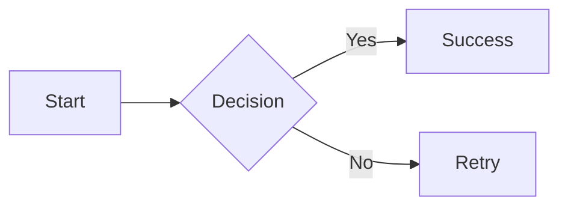
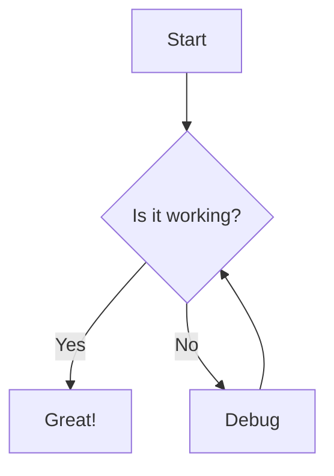
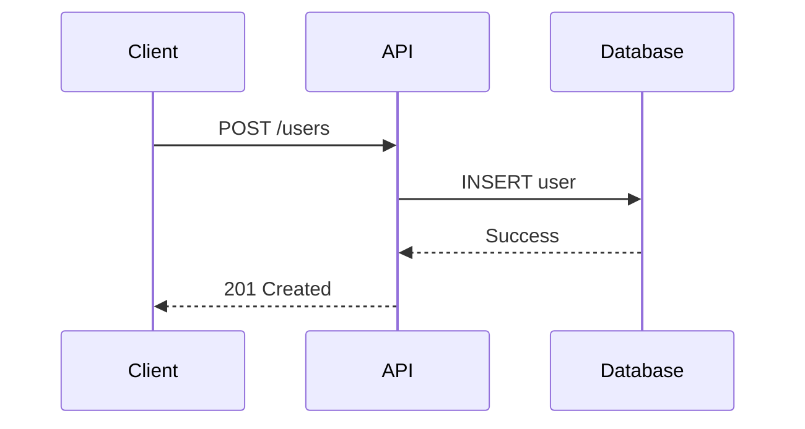
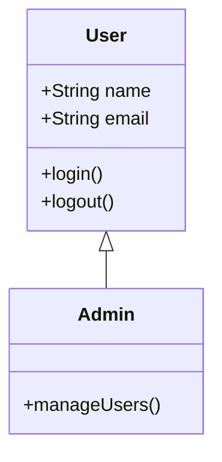
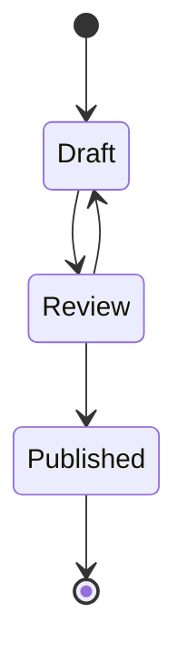
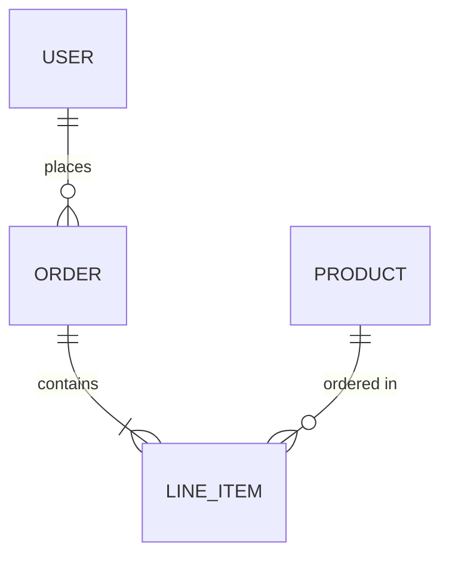
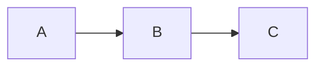
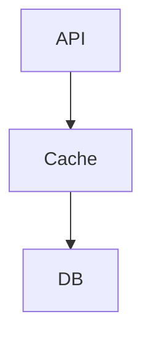

# Mermaid Diagrams

Tap has built-in support for [Mermaid](https://mermaid.js.org/) diagrams, allowing you to create flowcharts, sequence diagrams, and more using simple text syntax directly in your slides.

## Basic Usage

Add a mermaid code block to your slide:

````markdown

````

The diagram renders automatically when your slide is displayed.

## Supported Diagram Types

Tap supports all diagram types that Mermaid provides:

| Type | Use Case |
|------|----------|
| Flowchart | Process flows, decision trees |
| Sequence | API calls, system interactions |
| Class | Object-oriented designs |
| State | State machines, workflows |
| Entity Relationship | Database schemas |
| Gantt | Project timelines |
| Pie | Data distribution |
| Git | Branch visualization |
| Mindmap | Concept mapping |
| Timeline | Historical events |

## Examples

### Flowchart

````markdown

````

### Sequence Diagram

````markdown

````

### Class Diagram

````markdown

````

### State Diagram

````markdown

````

### Entity Relationship

````markdown

````

## Theme Integration

Mermaid diagrams automatically adapt to your presentation theme. Each of Tap's five themes includes a matching Mermaid color scheme:

| Theme | Mermaid Style |
|-------|--------------|
| Paper | Neutral tones with stone accents |
| Noir | Dark background with gold highlights |
| Aurora | Forest theme with teal and blue accents |
| Phosphor | Terminal aesthetic with green glow |
| Poster | High contrast with coral accents |

When you change your presentation theme, all Mermaid diagrams re-render with matching colors.

## Error Handling

If a diagram has a syntax error, Tap displays:
- An error message explaining the issue
- The original Mermaid code for debugging

Fix the syntax in your markdown file and the diagram will re-render on save.

## Tips

### Keep Diagrams Simple

Presentation diagrams should be readable from a distance. Favor:
- Fewer nodes (5-10 max per diagram)
- Short labels
- Clear directional flow

### Use Fragments for Reveals

Wrap diagrams in fragment syntax to reveal them with animation:

````markdown
<!-- fragment -->

````

### Combine with Layouts

Use the `two-column` layout to show a diagram alongside explanatory text:

````markdown
<!--
layout: two-column
-->

# Architecture

Our system uses three main components.

|||


````

## Quick Reference

| Feature | Syntax |
|---------|--------|
| Basic diagram | ` ```mermaid ... ``` ` |
| Flowchart (LR) | `flowchart LR` |
| Flowchart (TD) | `flowchart TD` |
| Sequence | `sequenceDiagram` |
| Class | `classDiagram` |
| State | `stateDiagram-v2` |
| ER Diagram | `erDiagram` |

## Next Steps

- See [Mermaid documentation](https://mermaid.js.org/syntax/flowchart.html) for full syntax reference
- Learn about [Layouts](/guide/layouts) for positioning diagrams
- Explore [Animations](/guide/animations-transitions) for diagram reveals
