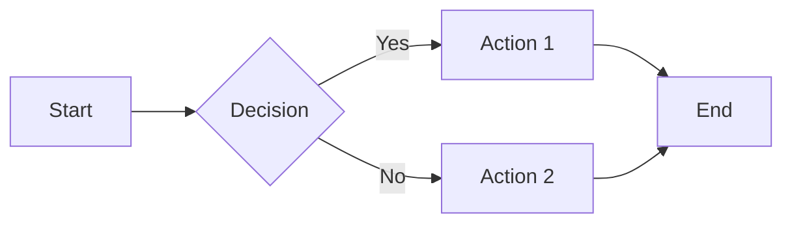

# Aurora Theme

Vibrant, dynamic, mesmerizing like the northern lights

---

## Design Philosophy

The Aurora theme features:

- **Vibrant colors** - Deep purples to electric blues to teals
- **Glassmorphism** - Frosted glass effects with backdrop blur
- **Animated gradients** - Subtle, mesmerizing movement
- **Modern aesthetics** - Fresh and eye-catching

---

## Color Palette

<!-- pause -->

Primary gradient: Purple (#4c1d95) to Blue (#0ea5e9) to Teal (#14b8a6)

<!-- pause -->

Accent color: Cyan glow effects

<!-- pause -->

Glass overlays with `backdrop-blur-xl` effects

---

## Code Blocks

```javascript
const gradient = {
  start: '#4c1d95',
  middle: '#0ea5e9',
  end: '#14b8a6',
  animation: '20s ease infinite'
};

const glass = {
  background: 'rgba(0, 0, 0, 0.6)',
  backdropBlur: 'xl'
};
```

Semi-transparent dark glass with cyan glow.

---

<!--
layout: two-column
-->

## Glassmorphism

Modern UI design trend

|||

### Characteristics
- Semi-transparent backgrounds
- Backdrop blur effects
- Glowing borders
- Floating appearance

|||

### Perfect For
- Modern startups
- Creative agencies
- Tech presentations
- Design showcases

---

<!--
layout: quote
-->

> Design is not just what it looks like. Design is how it works.

Steve Jobs

---

<!--
layout: section
-->

## Visual Impact

Make your content memorable

---

## Mermaid Diagrams

Diagrams with teal and purple aurora accents:



---

## Dynamic Elements

The Aurora theme excels at:

- **Standing out** in a sea of boring slides
- **Capturing attention** immediately
- **Creating emotion** through color
- **Modern aesthetics** that feel fresh

---

<!--
layout: big-stat
-->

## 3M+

color combinations in the gradient mesh

---

## Lists with Style

What makes Aurora special:

- Animated gradient backgrounds
- Glassmorphism overlays
- White text with glowing effects
- Cyan accent highlights

| Element | Effect |
|---------|--------|
| Backgrounds | Animated gradient mesh |
| Cards | Glass blur |
| Text | Soft glows |

---

## When to Use Aurora

- Startup pitches
- Creative presentations
- Product launches
- Conference talks
- Marketing materials
- Design reviews

---

<!--
layout: title
-->

# Aurora Theme

Where color meets content
