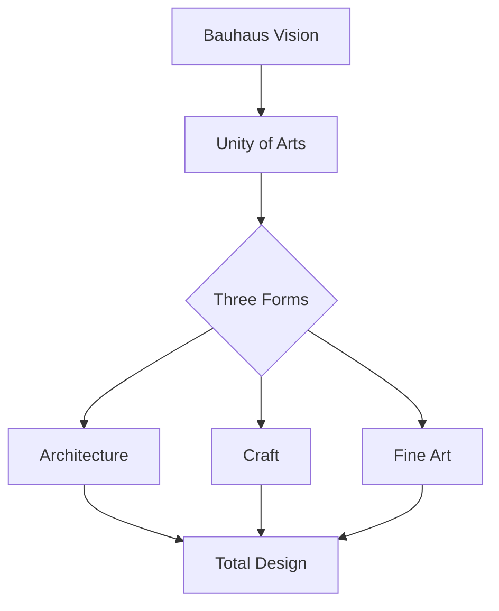

# Bauhaus Theme

Form follows function

---

## Design Philosophy

The Bauhaus movement revolutionized:

- **Geometric forms** - Circles, squares, triangles
- **Primary colors** - Red, yellow, blue only
- **Functional design** - No ornament without purpose
- **Unity of art** - Architecture, craft, and fine art as one

---

## Typography

<!-- pause -->

Bebas Neue for bold geometric headings

<!-- pause -->

Stark contrast with primary accents:
- Background: #ffffff (pure white)
- Text: #000000 (true black)
- Red: #e53935 | Yellow: #fdd835 | Blue: #1e88e5

---

## Code Blocks

```javascript
class BauhausGrid {
  constructor() {
    this.columns = 12;
    this.forms = ['circle', 'square', 'triangle'];
  }

  compose(elements) {
    // Geometry creates harmony
    return elements.map(el => ({
      form: this.forms[el.type],
      position: this.calculateGrid(el)
    }));
  }
}
```

Bold borders frame code with geometric precision.

---

<!--
layout: two-column
-->

## Form & Function

The Bauhaus principles in practice

|||

### The Masters
- Walter Gropius founded it
- Wassily Kandinsky taught color
- Paul Klee explored form
- Ludwig Mies van der Rohe led

|||

### The Principles
- Less is more
- Truth to materials
- Total work of art
- Form follows function

---

<!--
layout: quote
-->

> The ultimate aim of all artistic activity is building.

Walter Gropius, Bauhaus Manifesto 1919

---

<!--
layout: section
-->

## Primary Forms

Circle, square, triangle

---

## Visual Elements

The Bauhaus theme features:

- **Geometric shapes** - Circles and squares as decoration
- **Thick black borders** - Bold structural lines
- **Primary color markers** - Red, yellow, blue for lists
- **Grid backgrounds** - Subtle constructivist patterns

---

## Data Presentation

| School Location | Years | Director |
|-----------------|-------|----------|
| Weimar | 1919-1925 | Gropius |
| Dessau | 1925-1932 | Gropius/Meyer/Mies |
| Berlin | 1932-1933 | Mies |
| Chicago | 1937-1944 | Moholy-Nagy |

Tables with strong geometric borders.

---

<!--
layout: big-stat
-->

## 1919

The year Bauhaus was founded

---

## Content Flow

Key Bauhaus contributions:

- Modern furniture design
- Tubular steel chairs
- Functional typography
- Industrial aesthetics

The school's legacy lives on:

1. Influenced modern architecture
2. Shaped graphic design
3. Revolutionized product design
4. United craft and industry
5. Created design education standards

---

## Mermaid Diagrams



Diagrams with clean, functional aesthetics.

---

## When to Use Bauhaus

- Design school presentations
- Architecture lectures
- Modernism discussions
- Typography workshops
- Art history classes
- Product design reviews

---

## The Bauhaus Aesthetic

This theme draws inspiration from:

<!-- pause -->

**The Dessau Building** - Gropius's masterpiece

<!-- pause -->

**Kandinsky's Color Theory** - Primary harmony

<!-- pause -->

**Breuer's Wassily Chair** - Form meets function

---

<!--
layout: title
-->

# Bauhaus Theme

Where geometry becomes art
