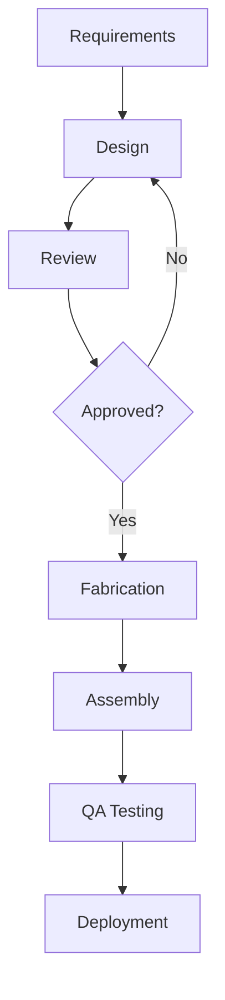

# Blueprint Theme

Technical Specification v1.0

---

## The Architectural Aesthetic

The blueprint style delivers precision:

- **Grid background** - Major and minor drafting lines
- **Cyan typography** - Crisp technical readability
- **Orange annotations** - Callout and warning highlights
- **Dimension lines** - Engineering-spec borders

---

## Design Specifications

<!-- pause -->

Oswald font for bold technical headings!

<!-- pause -->

A palette from the drafting table:
- Background: #1e3a5f (cyanotype blue)
- Text: #e0f2fe (technical white)
- Grid: #3b82f6 | Accent: #f97316

---

## Code Blocks

```typescript
interface BlueprintSpec {
  project: string;
  revision: number;
  scale: "1:50" | "1:100" | "1:200";
  tolerance: number;
}

function validateDrawing(spec: BlueprintSpec): boolean {
  const maxTolerance = spec.scale === "1:50" ? 0.5 : 1.0;
  return spec.tolerance <= maxTolerance;
}
```

Technical specifications with dimension markers!

---

<!--
layout: two-column
-->

## System Architecture

Left panel specifications and right panel details

|||

### Hardware Layer
- CPU: 8-core @ 3.2GHz
- RAM: 64GB DDR5
- Storage: 2TB NVMe
- Network: 10Gbps

|||

### Software Stack
- OS: Linux 6.x LTS
- Runtime: Node.js 20
- Database: PostgreSQL 16
- Cache: Redis 7.2

---

<!--
layout: quote
-->

> The details are not the details. They make the design.

Charles Eames, Industrial Designer

---

<!--
layout: section
-->

## TECHNICAL REVIEW

Quality assurance checkpoint

---

## Visual Elements

The Blueprint theme features:

- **Registration marks** - Cross-hair alignment guides
- **Dimension annotations** - Measurement indicators
- **Grid overlay** - Precision drafting lines
- **Technical callouts** - Specification notes

---

## Data Presentation

| Component | Specification | Tolerance |
|-----------|---------------|-----------|
| Width | 1920px | +/- 2px |
| Height | 1080px | +/- 2px |
| Aspect Ratio | 16:9 | Fixed |
| DPI | 96 | Minimum |

Tables styled as technical specification sheets!

---

<!--
layout: big-stat
-->

## 1:100

Standard architectural drawing scale

---

## Project Phases

Technical documentation workflow:

- Requirements gathering
- Schematic design
- Design development
- Construction documents

Engineering review stages:

1. Preliminary assessment
2. Structural analysis
3. System integration
4. Final certification
5. As-built documentation

---

## Mermaid Diagrams



Technical flowcharts with precise nodes.

---

## When to Use Blueprint

- Engineering presentations
- Technical specifications
- Architecture reviews
- System documentation
- Infrastructure planning
- DevOps workflows

---

## The Technical Heritage

This theme draws inspiration from:

<!-- pause -->

**Cyanotype process** - The original blue print technology

<!-- pause -->

**Architectural drafting** - Precision drawing standards

<!-- pause -->

**Engineering notation** - Technical specification formats

---

<!--
layout: title
-->

# Blueprint Theme

Precision-engineered presentations for technical minds

