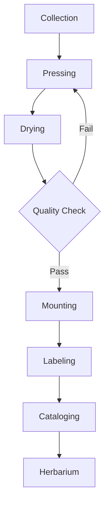

# Botanical

A journey through the world of natural history

---

## Design Philosophy

The Botanical theme embodies:

- **Victorian science** - The golden age of natural history
- **Herbarium specimens** - Dried flowers and pressed leaves
- **Scientific illustration** - Detailed botanical drawings
- **Museum labels** - Elegant specimen documentation

---

## Typography

<!-- pause -->

Libre Baskerville for elegant headings in italic style

<!-- pause -->

Natural earth tones with botanical greens:
- Background: #faf8f5 (aged ivory)
- Text: #3d3225 (sepia-toned)
- Accents: #4a5d4a, #c9a9a9, #8b7355 (green, floral, sepia)

---

## Code Blocks

```python
class Specimen:
    """A catalogued botanical specimen."""

    def __init__(self, genus, species):
        self.genus = genus
        self.species = species
        self.collected_date = None
        self.location = None

    def latin_name(self):
        # Binomial nomenclature per Linnaeus
        return f"{self.genus} {self.species}"
```

Scientific notation with delicate corner ornaments.

---

<!--
layout: two-column
-->

## Specimen Classification

Organizing nature's diversity

|||

### Flowering Plants
- Rosa damascena
- Lavandula angustifolia
- Papaver somniferum
- Digitalis purpurea

|||

### Ferns & Mosses
- Pteridium aquilinum
- Adiantum capillus-veneris
- Sphagnum palustre
- Polytrichum commune

---

<!--
layout: quote
-->

> In every walk with nature, one receives far more than one seeks.

John Muir

---

<!--
layout: section
-->

## The Herbarium

Where specimens tell their stories

---

## Visual Elements

The Botanical theme features:

- **Aged ivory paper** - Warm cream background with subtle texture
- **Botanical flourishes** - Elegant leaf and flower markers (❧ ✿ ❦ ✾)
- **Specimen frames** - Delicate corner ornaments on code blocks
- **Scientific typography** - Italic headings in the tradition of Latin nomenclature

---

## Data Presentation

| Species | Family | Discovered | Habitat |
|---------|--------|------------|---------|
| Rosa gallica | Rosaceae | Ancient | Europe |
| Tulipa gesneriana | Liliaceae | 1559 | Central Asia |
| Camellia sinensis | Theaceae | 2737 BC | China |
| Vanilla planifolia | Orchidaceae | 1520 | Mexico |

Tables styled as specimen catalogs.

---

<!--
layout: big-stat
-->

## 1753

Linnaeus publishes *Species Plantarum* — modern taxonomy begins

---

## Content Flow

Key aspects of the Botanical aesthetic:

- Cream and ivory paper backgrounds
- Delicate line borders and frames
- Soft green and sepia accents
- Scientific precision with artistic elegance

The collector's process:

1. Observe the specimen in habitat
2. Carefully press and preserve
3. Document with precise measurements
4. Catalog in the herbarium collection

---

## Mermaid Diagrams



Diagrams styled with natural history aesthetics.

---

## When to Use Botanical

- Natural history presentations
- Museum and gallery talks
- Scientific and academic lectures
- Garden and conservation topics
- Elegant wedding presentations
- Artisanal product showcases

---

## The Naturalist's Legacy

This theme draws inspiration from:

<!-- pause -->

**Herbarium traditions** - Pressed specimens dating to the 16th century

<!-- pause -->

**Scientific illustration** - Maria Sibylla Merian's metamorphosis studies

<!-- pause -->

**Victorian collectors** - The obsession with cataloguing nature

---

<!--
layout: title
-->

# Botanical

Cultivate your presentations with natural elegance
