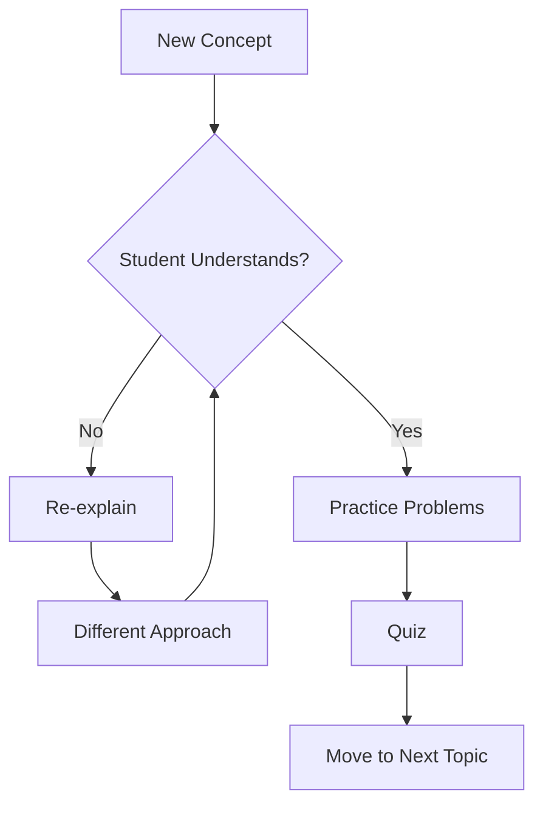

# Chalkboard Theme

Lessons from the Classroom

---

## The Classroom Aesthetic

Friendly, educational design inspired by traditional blackboards:

- **Dark green slate** - Classic classroom chalkboard feel
- **Chalk colors** - White, yellow, pink, blue, green
- **Handwritten typography** - Caveat and Patrick Hand fonts
- **Chalk dust texture** - Realistic worn board effects

---

## Design Philosophy

<!-- pause -->

Teaching is an art written in chalk.

<!-- pause -->

Core principles of educational design:
- Background: #2d4a3e (dark green slate)
- Typography: Caveat for display, Patrick Hand for body
- Accents: Pastel chalk colors that pop against the dark board

---

## Code Blocks

```typescript
interface Lesson {
  subject: string;
  topic: string;
  duration: number;
  difficulty: "beginner" | "intermediate" | "advanced";
}

function writeOnBoard(lesson: Lesson): string {
  const chalk = selectChalkColor(lesson.difficulty);
  return `${chalk}: ${lesson.topic} - ${lesson.duration} minutes`;
}
```

Hand-drawn border effect with chalk dust smudges!

---

<!--
layout: two-column
-->

## Teaching Methods

Comparing traditional and modern approaches

|||

### Traditional
- Chalk and blackboard lectures
- Handwritten notes and diagrams
- One-to-many instruction
- Physical classroom presence

|||

### Modern
- Digital presentations and screens
- Interactive whiteboards
- Hybrid and remote learning
- Video and multimedia content

---

<!--
layout: quote
-->

> Education is not the filling of a pail, but the lighting of a fire.

W.B. Yeats

---

<!--
layout: section
-->

## POP QUIZ!

Test your knowledge

---

## Visual Elements

The Chalkboard theme features:

- **Chalk dust texture** - Radial gradients create dusty surface
- **Sketchy underlines** - Imperfect chalk line effects
- **Pastel markers** - Rotating colors for list items
- **Hand-drawn borders** - Irregular border-radius for organic look

---

## Lesson Schedule

| Period | Subject | Teacher | Room |
|--------|---------|---------|------|
| 1st | Mathematics | Mr. Pythagoras | 101 |
| 2nd | History | Ms. Clio | 205 |
| 3rd | Science | Dr. Curie | Lab 3 |
| 4th | Literature | Prof. Shakespeare | 302 |

Ruled lines like a teacher's gradebook!

---

<!--
layout: big-stat
-->

## 42

The answer to everything

---

## Chalk Colors

The pastel palette brings warmth to education:

- Yellow highlights for emphasis
- Pink for important notes
- Blue for links and references
- Green for success indicators
- Orange for warnings and alerts

These colors evoke nostalgic classroom memories:

1. Spelling tests on the board
2. Math problems step by step
3. History timelines drawn in chalk
4. Science diagrams and formulas
5. Literature quotes and themes

---

## Mermaid Diagrams



Diagrams styled with classroom aesthetics.

---

## When to Use Chalkboard

- Educational content and tutorials
- Training and onboarding presentations
- Academic lectures and talks
- Nostalgic or retro themes
- Informal, friendly presentations
- Workshop and seminar materials

---

## The Learning Process

Every lesson builds understanding step by step:

<!-- pause -->

**Introduction** - Present the new concept clearly

<!-- pause -->

**Demonstration** - Show examples on the board

<!-- pause -->

**Practice** - Students work through problems together

---

<!--
layout: title
-->

# Chalkboard Theme

Class dismissed!
