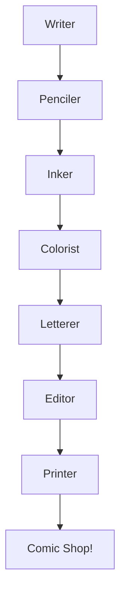

# Comic Theme

POW! BAM! KAPOW!

---

## The Pop Art Aesthetic

The comic book style brings:

- **Bold primaries** - Red, yellow, blue in your face!
- **Halftone dots** - Classic Ben-Day printing patterns
- **Speech bubbles** - Every quote becomes dialogue
- **Thick outlines** - Black borders on EVERYTHING

---

## Color Explosions

<!-- pause -->

Bangers font for explosive display headings!

<!-- pause -->

A palette straight from the printing press:
- Background: #ffffff (crisp newsprint white)
- Text: #000000 (pure black ink)
- Red: #ef4444 | Yellow: #facc15 | Blue: #3b82f6

---

## Code Blocks

```javascript
class SuperHero {
  constructor(name, power) {
    this.name = name;
    this.power = power;
    this.catchphrase = "POW!";
  }

  attack(villain) {
    console.log(`${this.catchphrase} ${this.name} uses ${this.power}!`);
    return villain.takeDamage(9001);
  }
}
```

Code panels with thick borders and offset shadows!

---

<!--
layout: two-column
-->

## Heroes & Villains

The eternal battle of good vs evil

|||

### The Heroes
- Super strength
- Lightning speed
- Laser vision
- Unbreakable will

|||

### The Villains
- Diabolical plans
- Secret lairs
- Henchmen armies
- Dramatic monologues

---

<!--
layout: quote
-->

> With great power comes great responsibility.

Uncle Ben, Amazing Fantasy #15

---

<!--
layout: section
-->

## KAPOW!

Action-packed section dividers

---

## Visual Elements

The Comic theme features:

- **Panel borders** - Thick black outlines on every element
- **Action markers** - Stars and bursts for list items
- **Drop shadows** - Offset black shadows for depth
- **Halftone textures** - Subtle dot patterns throughout

---

## Data Presentation

| Hero | Power | First Appearance |
|------|-------|------------------|
| Spider-Man | Web-slinging | 1962 |
| Batman | Detective skills | 1939 |
| Wonder Woman | Super strength | 1941 |
| Iron Man | Powered armor | 1963 |

Tables styled as comic panels with bold headers!

---

<!--
layout: big-stat
-->

## 1938

The year Superman debuted - comics changed forever!

---

## Content Flow

Classic comic techniques:

- Dynamic panel layouts
- Sound effect typography
- Motion lines and speed streaks
- Expressive color choices

Modern applications:

1. Marketing campaigns
2. Youth education
3. Brand storytelling
4. Event promotions
5. Social media graphics

---

## Mermaid Diagrams



Diagrams with bold, punchy aesthetics.

---

## When to Use Comic

- Fun, energetic presentations
- Youth and education audiences
- Entertainment and gaming topics
- Marketing and advertising
- Creative pitches
- Playful brand content

---

## The Comic Aesthetic

This theme draws inspiration from:

<!-- pause -->

**Roy Lichtenstein** - Pop art master of halftone dots

<!-- pause -->

**Jack Kirby** - King of dynamic comic composition

<!-- pause -->

**Golden Age Comics** - Bold, primary color palettes

---

<!--
layout: title
-->

# Comic Theme

Make every slide an action-packed adventure!

