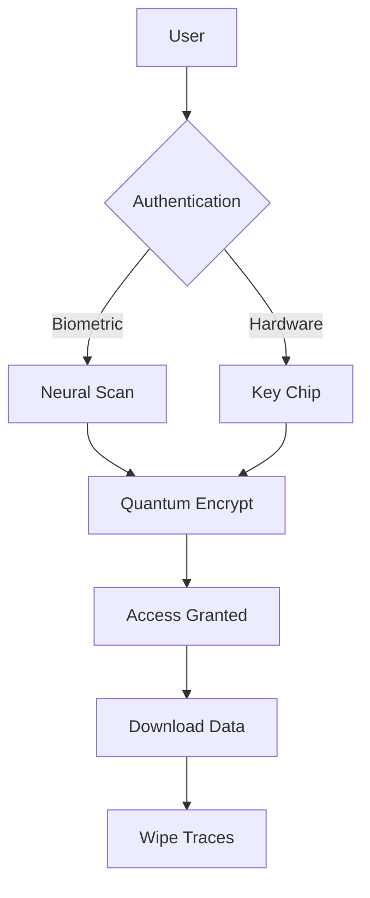

# Cyber Theme

System Initialization Complete

---

## The Cyberpunk Aesthetic

Neural interface connected:

- **Neon accents** - Electric blue, warning yellow, glitch magenta
- **Angular shapes** - Cut-corner holographic UI elements
- **Dark backdrop** - Near-black with scan line overlays
- **Tech typography** - Rajdhani headings, monospace data

---

## System Specifications

<!-- pause -->

Edge network protocols engaged!

<!-- pause -->

A palette from the neon underground:
- Background: #0a0a0f (void black)
- Primary: #00d4ff (electric blue)
- Warning: #ffcc00 | Alert: #ff00ff

---

## Code Blocks

```typescript
interface NeuralLink {
  user: string;
  implantId: string;
  bandwidth: number;
  encryption: "quantum" | "neural" | "hybrid";
}

async function initConnection(link: NeuralLink): Promise<void> {
  const socket = await QuantumSocket.create(link.implantId);
  await socket.handshake(link.encryption);
  console.log(`[NEURAL] ${link.user} connected`);
}
```

Terminal access with hacker aesthetics!

---

<!--
layout: two-column
-->

## Data Architecture

Dual-panel system interface

|||

### Input Layer
- Biometric scanners
- Neural interfaces
- Haptic feedback
- Voice recognition

|||

### Processing Core
- Quantum CPU cluster
- 256TB neural cache
- AI co-processor
- Holographic RAM

---

<!--
layout: quote
-->

> The street finds its own uses for things.

William Gibson, Neuromancer

---

<!--
layout: section
-->

## SYSTEM BREACH

Security protocol override

---

## Visual Elements

The Cyber theme delivers:

- **Hexagonal frames** - Data display containers
- **Glitch effects** - RGB split on hover states
- **HUD corners** - Tactical interface brackets
- **Scan lines** - Retro CRT monitor overlay

---

## Data Presentation

| Module | Status | Latency |
|--------|--------|---------|
| Neural Link | Active | 0.3ms |
| Quantum Core | Online | 0.1ms |
| Memory Bank | Synced | 0.5ms |
| ICE Firewall | Armed | 0.2ms |

Tables styled as tactical data grids!

---

<!--
layout: big-stat
-->

## 2077

The year everything changed

---

## Network Protocols

Cyberdeck interface layers:

- Intrusion countermeasures (ICE)
- Black ICE defensive systems
- Neural firewall protocols
- Quantum encryption keys

System override sequence:

1. Breach perimeter firewall
2. Disable motion sensors
3. Extract target data
4. Purge access logs
5. Exit clean

---

## Mermaid Diagrams



Network topology with neon-glow nodes.

---

## When to Use Cyber

- Tech conference presentations
- Cybersecurity briefings
- Gaming and esports events
- Sci-fi themed content
- Developer showcases
- Hacker culture talks

---

## The Digital Underground

This theme channels:

<!-- pause -->

**Blade Runner** - Neon-drenched urban dystopia

<!-- pause -->

**Ghost in the Shell** - Neural network aesthetics

<!-- pause -->

**The Matrix** - Digital rain and system interfaces

---

<!--
layout: title
-->

# Cyber Theme

Jack in to the future of presentations
