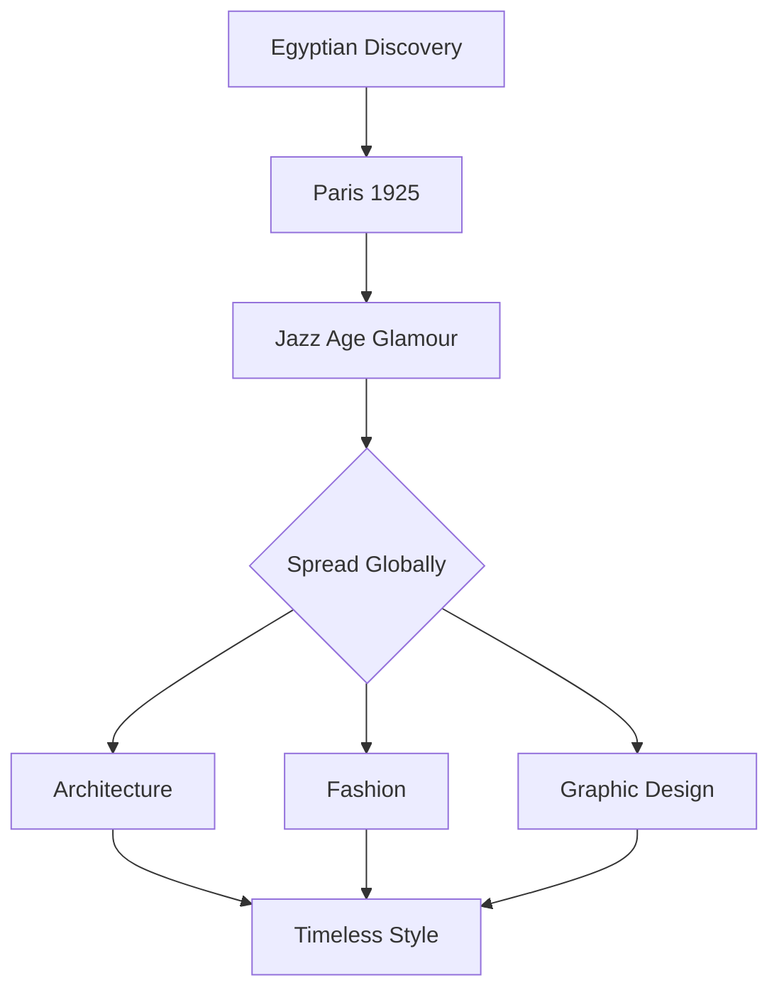

# Deco Theme

Gatsby-era glamour meets geometric luxury

---

## Design Philosophy

The Deco theme embodies:

- **Jazz Age elegance** - 1920s opulence and sophistication
- **Geometric precision** - Sunbursts, chevrons, and symmetry
- **Gold accents** - Luxurious metallic highlights
- **Bold contrast** - Deep black with cream and gold

---

## Typography

<!-- pause -->

Poiret One for geometric display headings

<!-- pause -->

Dramatic black and gold palette:
- Background: #0a0a0a (midnight black)
- Text: #f5f0e1 (champagne cream)
- Accent: #d4af37 (luxurious gold)

---

## Code Blocks

```python
class GrandBallroom:
    """A celebration of art deco architecture."""

    def __init__(self):
        self.chandeliers = []
        self.gilt_details = ["sunburst", "chevron", "fan"]

    def illuminate(self, guests):
        # Light up the evening
        return self.sparkle_with_elegance(guests)
```

Code styled with gold corner ornaments.

---

<!--
layout: two-column
-->

## Style & Substance

The art deco aesthetic

|||

### Architectural Influence
- Chrysler Building spires
- Radio City Music Hall
- Ocean liner interiors
- Grand hotel lobbies

|||

### Design Elements
- Sunburst patterns
- Chevron motifs
- Stepped forms
- Symmetrical balance

---

<!--
layout: quote
-->

> Style is a way to say who you are without having to speak.

Rachel Zoe

---

<!--
layout: section
-->

## The Roaring Twenties

When glamour knew no bounds

---

## Visual Elements

The Deco theme features:

- **Sunburst effects** - Radiating geometric patterns
- **Gold line work** - Thin elegant borders
- **Chevron patterns** - Zigzag decorative motifs
- **Diamond markers** - Geometric list styling

---

## Data Presentation

| Element | Era | Influence |
|---------|-----|-----------|
| Sunburst | 1920s | Egyptian revival |
| Chevron | 1925 | Paris Exposition |
| Ziggurat | 1930s | Mayan inspiration |
| Streamline | 1935 | Machine age |

Tables with luxurious gold headers.

---

<!--
layout: big-stat
-->

## 1925

The year Art Deco was born in Paris

---

## Content Flow

Key aspects of the Deco aesthetic:

- Symmetry and balance
- Geometric abstraction
- Rich materials and colors
- Machine-age optimism

The design process:

1. Establish geometric grid
2. Apply gold accent lines
3. Add sunburst focal points
4. Balance with negative space

---

## Mermaid Diagrams



Diagrams that complement the geometric aesthetic.

---

## When to Use Deco

- Luxury brand presentations
- 1920s themed events
- Architecture discussions
- Fashion and design talks
- Celebration announcements
- High-end product launches

---

## The Deco Aesthetic

This theme draws inspiration from:

<!-- pause -->

**Chrysler Building** - New York's crown jewel

<!-- pause -->

**Paris Exposition 1925** - Birth of the style

<!-- pause -->

**Hollywood glamour** - Silver screen elegance

---

<!--
layout: title
-->

# Deco Theme

Where geometry meets glamour

