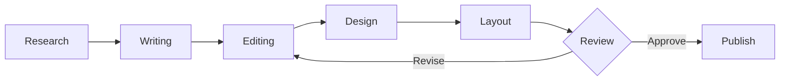

# Editorial

Classic magazine design, timeless typography

---

## Design Philosophy

The Editorial theme embodies:

- **Timeless elegance** - Inspired by The New Yorker and Esquire
- **Typography first** - Playfair Display meets Source Serif Pro
- **Restraint** - Single spot color used sparingly
- **Print heritage** - Fine rules, drop caps, pull quotes

---

## Typography

<!-- pause -->

Playfair Display for commanding headlines with classic serifs

<!-- pause -->

A refined palette of print conventions:
- Background: #ffffff (crisp white)
- Text: #000000 (true black)
- Accent: #7f1d1d (deep burgundy)

---

## Code Blocks

```typescript
class Magazine {
  private articles: Article[] = [];
  private layout: Layout;

  compose(content: Content): Spread {
    // Balance text and imagery with care
    const columns = this.layout.calculateColumns();
    return this.typeset(content, columns);
  }
}
```

Clean, minimal code styling with hairline borders.

---

<!--
layout: two-column
-->

## The Editorial Craft

Fine details matter

|||

### Typography
- Display headlines
- Refined body serifs
- Em-dash markers
- Drop cap styling

|||

### Layout
- Hairline rules
- Pull quotes
- Magazine spreads
- Balanced margins

---

<!--
layout: quote
-->

> Typography is the craft of endowing human language with a durable visual form.

Robert Bringhurst

---

<!--
layout: section
-->

## The Art of Print

Where tradition meets modern presentation

---

## Visual Elements

The Editorial theme features:

- **Hairline rules** - Fine 1px dividers for structure
- **Pull quotes** - Dramatic quotation marks
- **Drop caps** - Classic first-letter styling
- **Single accent** - Burgundy for emphasis only

---

## Data Presentation

| Publication | Founded | Style |
|-------------|---------|-------|
| The New Yorker | 1925 | Literary |
| Esquire | 1933 | Lifestyle |
| Harper's | 1850 | Commentary |
| The Atlantic | 1857 | Ideas |

Tables with clean lines and uppercase headers.

---

<!--
layout: big-stat
-->

## 1851

The Year Modern Publishing Began

---

## Content Structure

Key elements of editorial design:

- Clear visual hierarchy
- Generous white space
- Restrained color palette
- Consistent typographic rhythm

The numbered process:

1. Define the grid structure
2. Establish type scales
3. Apply spot color sparingly
4. Balance text and imagery

---

## Mermaid Diagrams



Clean diagrams that complement the editorial aesthetic.

---

## When to Use Editorial

- Annual reports and corporate presentations
- Academic lectures and literary talks
- Professional proposals and pitches
- Keynotes requiring gravitas
- Content-heavy informational decks
- Design and typography discussions

---

## The Editorial Aesthetic

This theme draws inspiration from:

<!-- pause -->

**Print journalism** - The craft of storytelling on paper

<!-- pause -->

**Book design** - Centuries of typographic refinement

<!-- pause -->

**Magazine layout** - Visual hierarchy and pacing

---

<!--
layout: title
-->

# Editorial

Where words speak with authority

