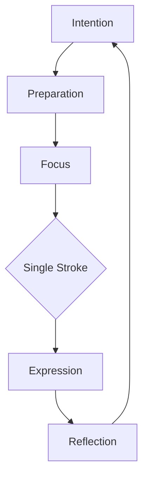

# Ink Theme

Zen minimalism meets Japanese calligraphy

---

## Design Philosophy

The Ink theme embodies:

- **Wabi-sabi** - Finding beauty in imperfection
- **Ma (negative space)** - Purposeful emptiness
- **Sumi-e inspiration** - Brush stroke aesthetics
- **Meditative balance** - Calm, deliberate design

---

## Typography

<!-- pause -->

Noto Serif JP for elegant Japanese-inspired headings

<!-- pause -->

Warm cream paper tones with deep sumi black:
- Background: #f5f1e8 (washi paper)
- Text: #1a1a1a (sumi ink)
- Accent: #c41e3a (vermillion)

---

## Code Blocks

```python
class ZenGarden:
    """A simple meditation on code clarity."""

    def __init__(self):
        self.stones = []
        self.raked_patterns = []

    def arrange(self, element):
        # Place with intention
        self.stones.append(element)
        return self.find_balance()
```

Subtle ink wash styling with clean presentation.

---

<!--
layout: two-column
-->

## Balance & Harmony

Traditional meets modern

|||

### Eastern Elements
- Brush stroke accents
- Washi paper textures
- Vermillion hanko seals
- Asymmetric layouts

|||

### Modern Clarity
- Clean typography
- Ample white space
- Focused content
- Minimal decoration

---

<!--
layout: quote
-->

> In the beginner's mind there are many possibilities, but in the expert's mind there are few.

Shunryu Suzuki

---

<!--
layout: section
-->

## The Art of Less

Subtract until only the essential remains

---

## Visual Elements

The Ink theme features:

- **Washi paper texture** - Warm, aged paper feel
- **Brush stroke dividers** - Organic, hand-drawn aesthetic
- **Vermillion accents** - Traditional seal red
- **Hanko stamps** - Decorative title elements

---

## Data Presentation

| Principle | Japanese | Meaning |
|-----------|----------|---------|
| Wabi | 侘 | Rustic simplicity |
| Sabi | 寂 | Beauty of age |
| Ma | 間 | Negative space |
| Kanso | 簡素 | Simplicity |

Tables with elegant serif typography.

---

<!--
layout: big-stat
-->

## 書道

The way of writing - Shodo

---

## Content Flow

Key aspects of the Ink aesthetic:

- Intentional negative space
- Warm, organic color palette
- Calligraphic brush influences
- Meditative pacing and transitions

Numbered steps for processes:

1. Prepare the ink stone
2. Grind the ink stick
3. Load the brush
4. Express with single strokes

---

## Mermaid Diagrams



Clean diagrams that complement the zen aesthetic.

---

## When to Use Ink

- Mindfulness presentations
- Japanese culture topics
- Art and design talks
- Philosophy discussions
- Meditation workshops
- Minimalist product reveals

---

## The Ink Aesthetic

This theme draws inspiration from:

<!-- pause -->

**Sumi-e painting** - Spontaneous brush expression

<!-- pause -->

**Shodo calligraphy** - The way of writing

<!-- pause -->

**Wabi-sabi philosophy** - Beauty in imperfection

---

<!--
layout: title
-->

# Ink Theme

Where brush meets paper
