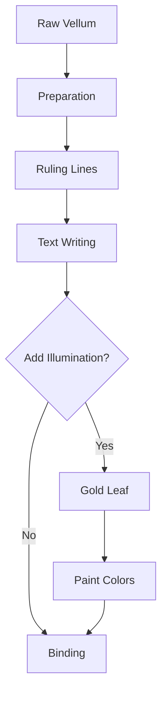

# Manuscript Theme

Illuminated elegance from the scriptorium

---

## Design Philosophy

The Manuscript theme embodies:

- **Monastic heritage** - Echoes of medieval scriptoriums
- **Illuminated artistry** - Gold leaf and rich pigments
- **Sacred craftsmanship** - Each letter placed with reverence
- **Timeless wisdom** - Knowledge preserved through ages

---

## Typography

<!-- pause -->

Cinzel Decorative for ornate display headings

<!-- pause -->

Warm parchment tones with sepia ink:
- Background: #f4e4bc (aged vellum)
- Text: #2c1810 (iron gall ink)
- Accents: burgundy, gold, royal blue

---

## Code Blocks

```python
class Scriptorium:
    """A medieval workshop for manuscript creation."""

    def __init__(self):
        self.parchment = []
        self.inks = ["iron gall", "vermillion", "gold leaf"]

    def illuminate(self, initial):
        # Adorn the capital letter
        return self.apply_gold_leaf(initial)
```

Code styled with aged parchment elegance.

---

<!--
layout: two-column
-->

## Sacred & Secular

The art of illumination

|||

### Monastic Tradition
- Book of Kells inspiration
- Lindisfarne Gospels
- Decorated initials
- Marginalia flourishes

|||

### Literary Heritage
- Gilded borders
- Floral vine patterns
- Heraldic beasts
- Intricate knotwork

---

<!--
layout: quote
-->

> In the beginning was the Word, and scribes preserved it for eternity with ink and gold.

Medieval Proverb

---

<!--
layout: section
-->

## The Scriptorium

Where patience becomes art

---

## Visual Elements

The Manuscript theme features:

- **Aged parchment texture** - Warm, weathered vellum
- **Gold accents** - Illuminated letter flourishes
- **Decorative borders** - Ornate medieval framing
- **Initial capitals** - Drop cap styling

---

## Data Presentation

| Element | Latin | Purpose |
|---------|-------|---------|
| Rubrication | rubrum | Red headings |
| Illumination | illuminare | Gold decoration |
| Miniature | minium | Small paintings |
| Marginalia | margo | Border notes |

Tables with medieval scholarly elegance.

---

<!--
layout: big-stat
-->

## XII

Centuries of manuscript tradition

---

## Content Flow

Key aspects of illuminated manuscripts:

- Hours of painstaking labor
- Precious pigments and gold
- Vellum from finest calfskin
- Quills cut with precision

The scribe's process:

1. Prepare the parchment
2. Rule the guidelines
3. Write the text in iron gall
4. Add rubrics and illuminations

---

## Mermaid Diagrams



Diagrams styled for the manuscript aesthetic.

---

## When to Use Manuscript

- Medieval history presentations
- Religious or liturgical topics
- Literary heritage discussions
- Academic humanities talks
- Museum and archive content
- Classical education materials

---

## The Manuscript Aesthetic

This theme draws inspiration from:

<!-- pause -->

**Book of Kells** - Insular art masterpiece

<!-- pause -->

**Les Tres Riches Heures** - Gothic illumination

<!-- pause -->

**Gutenberg Bible** - Dawn of printing

---

<!--
layout: title
-->

# Manuscript Theme

Words illuminated through the ages
