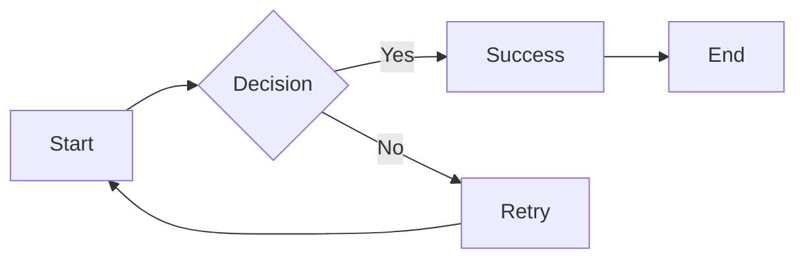

# Noir Theme

Cinematic sophistication meets film noir elegance

---

## Design Philosophy

The Noir theme offers:

- **Deep blacks** - Rich charcoal backgrounds (#0a0a0a)
- **Crisp whites** - High contrast text (#fafafa)
- **Gold accents** - Sophisticated touches (#c9a227)
- **Cinematic depth** - Multi-layer shadows and vignette

---

## Typography

<!-- pause -->

Playfair Display for elegant serif headings

<!-- pause -->

Inter for clean, readable body text:
- Titles: 8rem
- Headers: 6rem / 4rem
- Body: 2rem
- Code: 1.5rem

---

## Code Blocks

```swift
struct Presentation: Identifiable {
    let id = UUID()
    var title: String
    var slides: [Slide]
    var theme: Theme = .noir

    func present() async {
        for slide in slides {
            await display(slide)
        }
    }
}
```

Elevated cards with refined shadows.

---

<!--
layout: two-column
-->

## Two Column Layout

Balanced and sophisticated

|||

### Feature List
- Enterprise ready
- Boardroom appropriate
- Client presentations
- Executive summaries

|||

### Capabilities
- Rich typography
- Cinematic shadows
- Smooth transitions
- Vignette effects

---

<!--
layout: quote
-->

> Innovation distinguishes between a leader and a follower.

Steve Jobs

---

<!--
layout: section
-->

## Polish & Refinement

Every pixel considered

---

## Visual Elements

The Noir theme includes:

- **Vignette overlay** - Subtle darkening at edges
- **Multi-layer shadows** - Depth without harshness
- **Subtle gradients** - Dark-to-darker for richness
- **Gold accents** - Sophisticated highlight color

---

## Data Presentation

| Quarter | Revenue | Growth |
|---------|---------|--------|
| Q1 | $1.2M | +12% |
| Q2 | $1.4M | +17% |
| Q3 | $1.8M | +29% |
| Q4 | $2.1M | +17% |

Tables that look professional and executive.

---

<!--
layout: big-stat
-->

## 42%

increase in engagement

---

## Lists & Content

Key features of the Noir theme:

- Cinematic, sophisticated appearance
- Works in executive business contexts
- Deep blacks with crisp white text
- Gold accents for emphasis

Numbers work well too:

1. First step in the process
2. Second step to follow
3. Final step to complete

---

## Mermaid Diagrams



Theme-aware diagrams with gold accents.

---

## When to Use Noir

- Board presentations
- Client pitches
- Investor meetings
- Company all-hands
- Product announcements
- Executive briefings

---

## Noir Aesthetic

The theme draws from:

<!-- pause -->

**Film noir** - Deep shadows and dramatic lighting

<!-- pause -->

**Luxury brands** - Gold accents and refined typography

<!-- pause -->

**Executive style** - Sophisticated and professional

---

<!--
layout: title
-->

# Noir Theme

Where sophistication meets cinema
