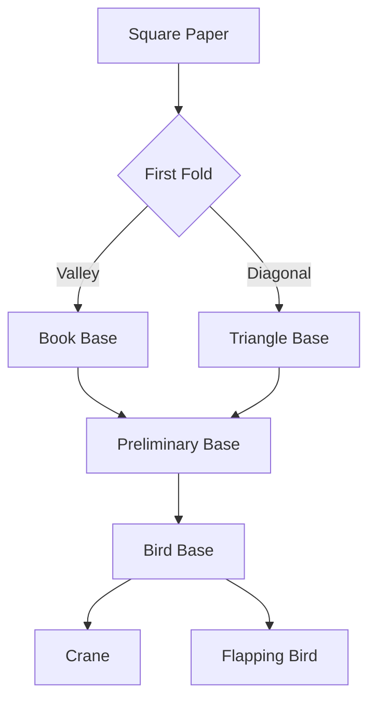

# Origami Theme

The Art of Folded Paper

---

## The Paper Craft Aesthetic

Clean minimal design inspired by Japanese paper folding:

- **Pure white background** - Like crisp, pristine paper
- **Subtle shadows** - Creating depth and dimension
- **Geometric markers** - Triangles, diamonds, and squares
- **Quicksand typography** - Modern geometric sans-serif

---

## Design Philosophy

<!-- pause -->

Simplicity reveals beauty.

<!-- pause -->

Core principles of origami design:
- Background: #ffffff (pristine white)
- Typography: Quicksand geometric sans
- Accents: Blue, rose, emerald, amber, violet

---

## Code Blocks

```typescript
interface PaperFold {
  name: string;
  folds: number;
  difficulty: "beginner" | "intermediate" | "master";
  traditionalName?: string;
}

function createCrane(paper: PaperFold): string {
  const steps = calculateFolds(paper.folds);
  return steps.map(fold => executeFold(fold)).join(" → ");
}
```

Paper card styling with folded corner effect!

---

<!--
layout: two-column
-->

## Valley & Mountain Folds

Essential techniques for paper craft

|||

### Valley Folds
- Paper folds toward you
- Creates concave crease
- Foundation of most models
- Marked with dashed lines

|||

### Mountain Folds
- Paper folds away from you
- Creates convex crease
- Often used for structure
- Marked with dash-dot lines

---

<!--
layout: quote
-->

> One piece of paper. One thousand possibilities.

Traditional Japanese Paper Master

---

<!--
layout: section
-->

## SENBAZURU

One thousand cranes, one wish granted

---

## Visual Elements

The Origami theme features:

- **Folded corners** - CSS triangle paper fold effects
- **Layered shadows** - Multi-depth paper stacking
- **Geometric list markers** - Rotating shapes by color
- **Paper crane silhouette** - Decorative title accent

---

## Difficulty Levels

| Model | Folds | Time | Level |
|-------|-------|------|-------|
| Crane | 24 | 10 min | Intermediate |
| Butterfly | 12 | 5 min | Beginner |
| Dragon | 60+ | 45 min | Master |
| Rose | 36 | 25 min | Advanced |

Tables with clean minimal styling!

---

<!--
layout: big-stat
-->

## 1,000

Cranes for a wish in Japanese tradition

---

## Classic Origami Models

Traditional Japanese paper folding:

- Orizuru (paper crane)
- Kabuto (samurai helmet)
- Shuriken (throwing star)
- Kusudama (medicine ball)

Modern interpretations:

1. Tessellations and patterns
2. Modular origami sculptures
3. Wet-folding techniques
4. Kirigami cut-paper art
5. Action origami toys

---

## Mermaid Diagrams



Clean diagram styling with paper aesthetics.

---

## When to Use Origami

- Minimalist presentations
- Creative portfolio showcases
- Design system documentation
- Craft and art tutorials
- Japanese culture content
- Clean product launches

---

## The Folding Process

Each creation begins with a single sheet:

<!-- pause -->

**Preparation** - Select paper, orient grain direction

<!-- pause -->

**Foundation** - Create base folds for structure

<!-- pause -->

**Refinement** - Precise creases bring form to life

---

<!--
layout: title
-->

# Origami Theme

Fold your story into shape
