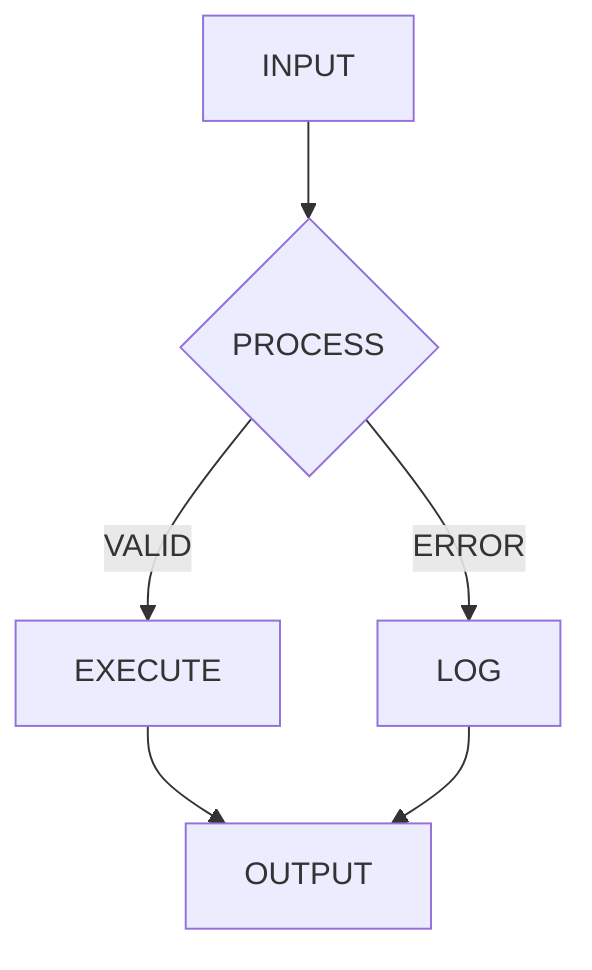

# Phosphor Theme

$ ./present --theme=crt

---

## Design Philosophy

The Phosphor theme brings:

- **CRT aesthetic** - True black with phosphor green glow
- **Monospace everything** - JetBrains Mono throughout
- **Scanline effects** - Authentic retro overlay
- **Hacker vibes** - Like presenting in a terminal

---

## Color Options

<!-- pause -->

$ echo "Primary: Phosphor green (#00ff00)"

<!-- pause -->

$ echo "Background: True black (#000)"

<!-- pause -->

$ export GLOW_EFFECT="0 0 5px, 0 0 10px, 0 0 20px"

---

## Code Blocks

```bash
#!/bin/bash
# Phosphor theme makes everything a terminal

function present() {
    local topic="$1"
    echo "Presenting: $topic"

    while read -r slide; do
        render "$slide"
        wait_for_input
    done < slides.md
}

present "Phosphor Theme"
```

---

## Live Execution

```bash {driver: shell}
echo "$ whoami"
whoami

echo ""
echo "$ date"
date

echo ""
echo "$ uptime"
uptime
```

---

<!--
layout: two-column
-->

## ASCII Art Welcome

```
 _____
|_   _|_ _ _ __
  | |/ _` | '_ \
  | | (_| | |_) |
  |_|\__,_| .__/
          |_|
```

|||

### Perfect For

- Developer conferences
- Technical deep-dives
- Security talks
- Hacking demos
- System administration
- DevOps presentations

---

<!--
layout: quote
-->

> /* There is no place like 127.0.0.1 */

Every Hacker Ever

---

<!--
layout: section
-->

## Visual Effects

$ cat /etc/effects

---

## Mermaid Diagrams



---

## CRT Effects

The Phosphor theme includes:

- **Scanlines** - Subtle horizontal lines via gradient
- **Text glow** - Multi-layer phosphor glow shadows
- **Vignette** - Screen curve darkening at edges
- **Subtle pulse** - Optional breathing animation

All effects respect `prefers-reduced-motion`.

---

## System Information

```bash {driver: shell}
echo "=== System Info ==="
echo "Hostname: $(hostname)"
echo "OS: $(uname -s)"
echo "Kernel: $(uname -r)"
echo "Architecture: $(uname -m)"
echo "==================="
```

---

<!--
layout: big-stat
-->

## 1337

lines of pure aesthetics

---

## Phosphor Tips

> Use > for blockquotes
> Like comments in config files

List items get $ prefix:
- First command
- Second command
- Third command

| Feature | Status |
|---------|--------|
| Glow | ON |
| Scanlines | ON |
| Pulse | SUBTLE |

---

## When to Use Phosphor

- Hacker conferences (DEF CON, Black Hat)
- Developer meetups
- System administration talks
- Security presentations
- CLI tool demos
- Any talk where you want to look cool

---

<!--
layout: title
-->

# Phosphor Theme

$ exit 0
