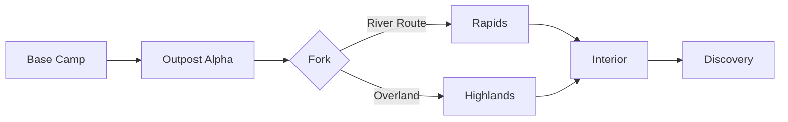

# Safari

Adventures in the golden age of exploration

---

## Design Philosophy

The Safari theme embodies:

- **Victorian exploration** - The golden age of discovery
- **Field journals** - Documented adventures and observations
- **Aged parchment** - Maps and expedition records
- **Brass & leather** - Authentic explorer equipment

---

## Typography

<!-- pause -->

Spectral for elegant old-world headings

<!-- pause -->

Warm earth tones with explorer accents:
- Background: #f5f0e1 (aged parchment)
- Text: #3d2914 (rich brown)
- Accents: #2d5016, #b8860b, #6b1c23 (forest, brass, burgundy)

---

## Code Blocks

```python
class Expedition:
    """Field notes from the interior."""

    def __init__(self, destination):
        self.destination = destination
        self.discoveries = []
        self.supplies = {"quinine": 100, "compass": 1}

    def log_observation(self, specimen):
        # Record findings in field journal
        self.discoveries.append(specimen)
        return f"Specimen catalogued: {specimen}"
```

Typewriter-styled code with expedition journal framing.

---

<!--
layout: two-column
-->

## The Explorer's Kit

Essential equipment for the journey

|||

### Navigation
- Brass sextant
- Surveyor's compass
- Expedition maps
- Field telescope

|||

### Documentation
- Leather journal
- Fountain pen
- Specimen boxes
- Camera obscura

---

<!--
layout: quote
-->

> The wilderness holds answers to questions we have not yet learned to ask.

Nancy Newhall

---

<!--
layout: section
-->

## Into the Interior

Where maps end and discovery begins

---

## Visual Elements

The Safari theme features:

- **Aged parchment** - Vintage paper texture with foxing
- **Compass markers** - Expedition waypoint styling
- **Double-ruled borders** - Victorian document framing
- **Brass accents** - Authentic metallic highlights

---

## Data Presentation

| Expedition | Year | Discovery | Region |
|------------|------|-----------|--------|
| Livingstone | 1855 | Victoria Falls | Africa |
| Darwin | 1835 | Evolution evidence | Galápagos |
| Humboldt | 1799 | Botanical specimens | Americas |
| Scott | 1912 | South Pole | Antarctica |

Tables with expedition log styling.

---

<!--
layout: big-stat
-->

## 1871

Stanley finds Livingstone - "Dr. Livingstone, I presume?"

---

## Content Flow

Key aspects of the Safari aesthetic:

- Weathered parchment backgrounds
- Compass rose decorations
- Dotted travel route borders
- Sepia-toned vintage feel

The expedition process:

1. Chart the unknown territory
2. Assemble the expedition party
3. Document every discovery
4. Map the journey home

---

## Mermaid Diagrams



Diagrams styled with expedition mapping aesthetics.

---

## When to Use Safari

- History and exploration topics
- Museum and archive presentations
- Travel and adventure stories
- Natural history discussions
- Geographic society talks
- Vintage brand presentations

---

## The Explorer's Journey

This theme draws inspiration from:

<!-- pause -->

**Victorian expeditions** - Livingstone, Stanley, Burton

<!-- pause -->

**Natural history** - Darwin's voyages and field observations

<!-- pause -->

**Cartography** - The art of mapping uncharted territories

---

<!--
layout: title
-->

# Safari

Chart your course into the unknown

