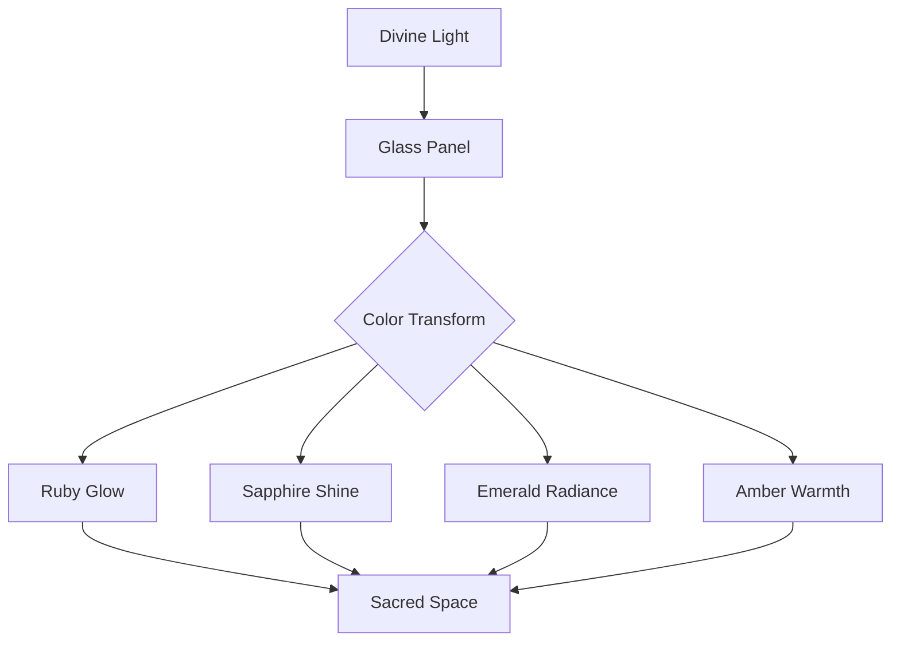

# Stained Glass Theme

Light transformed through jewel-toned panels

---

## Cathedral Aesthetics

The Stained Glass theme draws from:

- **Rose windows** - Radiant circular compositions
- **Jewel tones** - Ruby, sapphire, emerald, amber
- **Gold leading** - The metalwork between glass panels
- **Gothic architecture** - Soaring, reverent spaces

---

## Typography

<!-- pause -->

Uncial Antiqua for gothic display headings

<!-- pause -->

Deep cathedral darkness with luminous text:
- Background: #0c1222 (midnight navy)
- Text: #f8fafc (luminous white)
- Accent: #c9a227 (gold leading)

---

## Code Blocks

```javascript
class CathedralWindow {
  constructor() {
    this.panels = [];
    this.leadingLines = [];
  }

  addPanel(color, position) {
    // Each piece tells part of the story
    this.panels.push({ color, position });
    return this.calculateLight();
  }
}
```

Gold-bordered panels with corner jewel accents.

---

<!--
layout: two-column
-->

## Light & Color

The interplay of sacred elements

|||

### The Four Jewels
- Ruby for passion and sacrifice
- Sapphire for heavenly wisdom
- Emerald for eternal hope
- Amber for divine warmth

|||

### The Craft
- Lead cames bind the glass
- Grisaille adds fine detail
- Pot metal holds deep color
- Flash glass creates gradients

---

<!--
layout: quote
-->

> The windows glowed like the gates of paradise, transforming mere light into something holy.

Victor Hugo on Notre-Dame

---

<!--
layout: section
-->

## The Rose Window

A mandala of light and devotion

---

## Visual Elements

The Stained Glass theme features:

- **Rose window glow** - Radiant backdrop on title slides
- **Gold leading borders** - Elegant panel framing
- **Jewel markers** - Ruby, sapphire, emerald, amber for lists
- **Corner ornaments** - Gothic bracket decorations

---

## Data Presentation

| Cathedral | Country | Famous Window |
|-----------|---------|---------------|
| Notre-Dame | France | North Rose |
| Chartres | France | Blue Virgin |
| Canterbury | England | Corona |
| Cologne | Germany | Bavarian Window |

Tables framed with gold leading lines.

---

<!--
layout: big-stat
-->

## XIII

Centuries of stained glass tradition

---

## Content Flow

Key aspects of cathedral glass:

- Narrative storytelling in light
- Color theory through medieval eyes
- Structural support meets art
- Sun position planning

The craft evolved through generations:

1. Design the cartoon (full-scale drawing)
2. Select and cut the glass
3. Paint details with vitreous enamel
4. Lead the pieces together
5. Install and weather-seal

---

## Mermaid Diagrams



Diagrams that capture the flow of light.

---

## When to Use Stained Glass

- Religious or spiritual presentations
- Art history lectures
- Gothic and medieval topics
- Architecture discussions
- Museum exhibition talks
- Heritage and preservation

---

## The Stained Glass Aesthetic

This theme draws inspiration from:

<!-- pause -->

**Chartres Cathedral** - The finest medieval glass

<!-- pause -->

**Gothic Revival** - 19th century renaissance

<!-- pause -->

**Tiffany Studios** - American glass artistry

---

<!--
layout: title
-->

# Stained Glass Theme

Where light becomes sacred art
