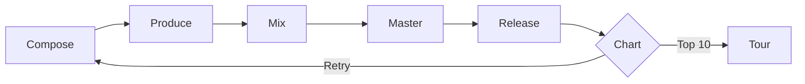

# Synthwave

Ride the neon grid into the digital sunset

---

## Design Philosophy

The Synthwave theme embodies:

- **Retro-futurism** - 1980s visions of tomorrow
- **Neon aesthetics** - Hot pink, electric cyan, sunset orange
- **Chrome typography** - Orbitron meets gradient glory
- **Grid horizons** - Infinite perspective into the night

---

## Typography

<!-- pause -->

Orbitron for commanding chrome display headings

<!-- pause -->

A vibrant neon palette:
- Background: #0f0a1e (deep purple night)
- Text: #f0e6ff (soft lavender glow)
- Accents: #ff2d95, #00fff5, #ff6b35 (hot pink, cyan, orange)

---

## Code Blocks

```typescript
class Retrowave {
  private grid: PerspectiveGrid;
  private sunset: GradientSun;

  render(timestamp: number): void {
    // Ride the endless digital highway
    this.grid.scroll(timestamp * 0.001);
    this.sunset.pulse(Math.sin(timestamp));
  }
}
```

Neon-bordered code with scanline overlay effects.

---

<!--
layout: two-column
-->

## The Synthwave Aesthetic

Embrace the neon night

|||

### Visual Elements
- Perspective grid floors
- Chrome text gradients
- Multi-layer glow effects
- Sunset color transitions

|||

### Influences
- Blade Runner
- Tron
- Miami Vice
- Outrun games

---

<!--
layout: quote
-->

> The future is not what it used to be. It's better.

Retro Futurist Manifesto

---

<!--
layout: section
-->

## Into the Grid

Where the horizon meets infinity

---

## Visual Elements

The Synthwave theme features:

- **Neon glow** - Multi-layer text and box shadows
- **Chrome gradients** - Metallic text effects on titles
- **Grid perspective** - 80s-style horizon effect
- **Scanlines** - CRT monitor aesthetic on code blocks

---

## Data Presentation

| Era | Influence | Signature Element |
|-----|-----------|-------------------|
| 1982 | Blade Runner | Neon rain |
| 1983 | War Games | Terminal green |
| 1984 | Terminator | Chrome skulls |
| 1985 | Back to Future | DeLorean trails |

Tables with neon borders and cyan headers.

---

<!--
layout: big-stat
-->

## 1984

The Year of Synthwave Dreams

---

## Content Structure

Key elements of synthwave design:

- Hot pink primary accents
- Electric cyan secondary highlights
- Sunset orange warmth
- Deep purple backgrounds

The retrowave process:

1. Establish the dark canvas
2. Add perspective grid horizon
3. Layer neon glow effects
4. Apply chrome text gradients

---

## Mermaid Diagrams



Diagrams styled for the retrowave aesthetic.

---

## When to Use Synthwave

- Gaming and entertainment presentations
- Music and audio production talks
- Nostalgic tech retrospectives
- Creative agency pitches
- Product launches with retro vibes
- Conference talks seeking energy

---

## The Retrowave Journey

This theme draws inspiration from:

<!-- pause -->

**Synthwave music** - Kavinsky, Com Truise, Gunship

<!-- pause -->

**80s cinema** - Neon-lit cityscapes and chrome futures

<!-- pause -->

**Retro gaming** - Outrun, Far Cry 3: Blood Dragon

---

<!--
layout: title
-->

# Synthwave

Chase the sunset on the digital highway

