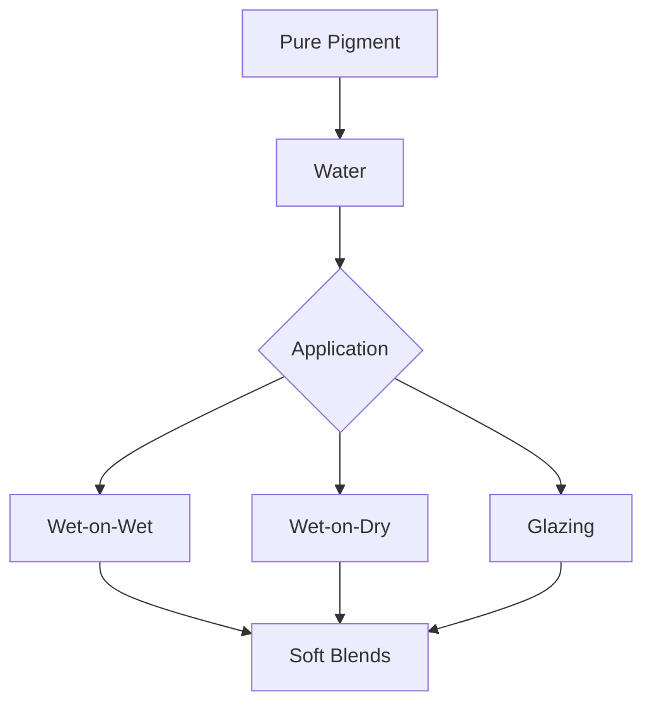

# Watercolor Theme

Soft strokes, gentle beauty

---

## The Painted Canvas

The watercolor aesthetic embraces:

- **Soft washes** - Gentle color bleeds and gradients
- **Organic edges** - Nothing harsh, everything flows
- **Elegant typography** - Cormorant Garamond serif
- **Natural palette** - Blush, sage, sky, lavender

---

## Color & Light

<!-- pause -->

Cormorant Garamond brings painterly elegance

<!-- pause -->

A palette inspired by watercolor pigments:
- Background: #fefefe (soft white paper)
- Text: #374151 (gentle charcoal)
- Blush: #fce4ec | Sage: #e8f5e9 | Sky: #e3f2fd

---

## Code Blocks

```javascript
class WatercolorBrush {
  constructor(pigment) {
    this.pigment = pigment;
    this.water = 0.7; // dilution ratio
  }

  paint(canvas, stroke) {
    // Let colors flow and blend
    return canvas.apply({
      color: this.dilute(this.pigment),
      edge: 'soft',
      bleed: true
    });
  }
}
```

Code with soft edges and gentle backgrounds.

---

<!--
layout: two-column
-->

## Pigments & Paper

The art of watercolor technique

|||

### Wet-on-Wet
- Colors blend naturally
- Soft, dreamy effects
- Unpredictable beauty
- Organic gradients

|||

### Wet-on-Dry
- Crisp, defined edges
- Layered transparencies
- Controlled washes
- Delicate details

---

<!--
layout: quote
-->

> The watercolor paints itself, you simply guide the water.

Georgia O'Keeffe on the flowing medium

---

<!--
layout: section
-->

## Impressions

Where light meets pigment

---

## Visual Elements

The Watercolor theme features:

- **Paint washes** - Soft color backgrounds with blurred edges
- **Organic shapes** - No harsh corners or rigid lines
- **Subtle textures** - Paper grain and pigment settling
- **Gentle transitions** - Everything fades and flows

---

## Data Presentation

| Pigment | Character | Best For |
|---------|-----------|----------|
| Blush | Warm, intimate | Romance, beauty |
| Sage | Fresh, natural | Nature, wellness |
| Sky | Calm, open | Technology, clarity |
| Lavender | Dreamy, creative | Art, imagination |

Tables with soft borders and gentle styling.

---

<!--
layout: big-stat
-->

## 1856

When the Impressionists began their revolution

---

## Content Flow

Classic watercolor techniques:

- Graduated washes
- Wet-into-wet blending
- Dry brush texture
- Lifting and blooming

Modern applications:

1. Illustration and editorial
2. Wedding and event design
3. Brand identity systems
4. User interface accents
5. Digital art and animation

---

## Mermaid Diagrams



Diagrams with soft, organic aesthetics.

---

## When to Use Watercolor

- Art and creative presentations
- Wedding and event planning
- Beauty and wellness brands
- Nature and botanical topics
- Mindfulness and meditation
- Gentle, calming messages

---

## The Watercolor Aesthetic

This theme draws inspiration from:

<!-- pause -->

**Impressionism** - Capturing light and atmosphere

<!-- pause -->

**Botanical illustration** - Delicate natural beauty

<!-- pause -->

**Japanese ink wash** - Simplicity and negative space

---

<!--
layout: title
-->

# Watercolor Theme

Let your ideas flow like paint on paper

