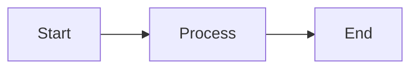
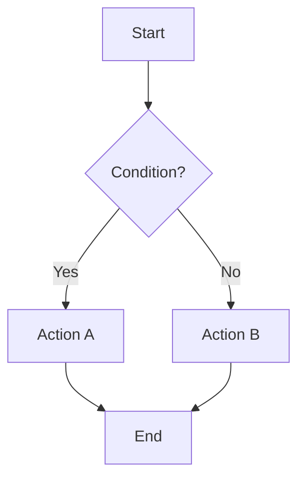
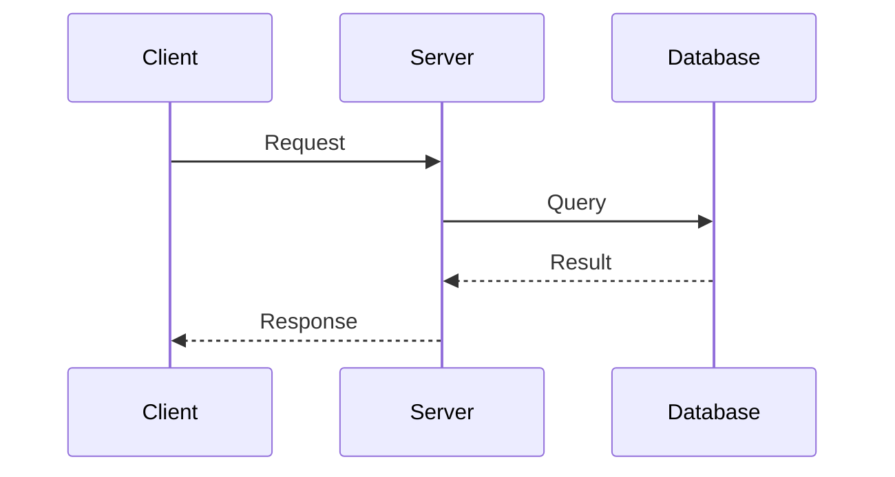
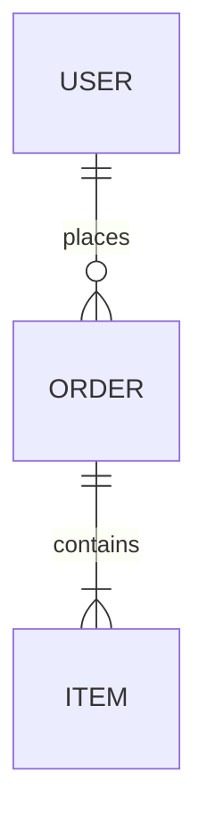
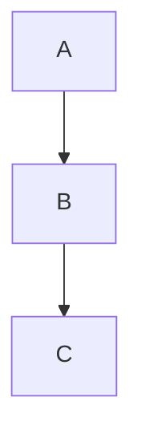
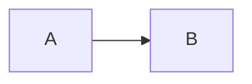

# Mermaid Diagrams

Tap renders Mermaid diagrams automatically from fenced code blocks.

## Syntax

Use a `mermaid` code block:

````markdown

````

## Supported Diagram Types

- `flowchart` - Process flows, decision trees (use `LR`, `TD`, `TB`, `RL`, `BT` for direction)
- `sequenceDiagram` - API calls, system interactions
- `classDiagram` - Object-oriented designs
- `stateDiagram-v2` - State machines
- `erDiagram` - Database entity relationships
- `gantt` - Project timelines
- `pie` - Data distribution
- `gitGraph` - Branch visualization
- `mindmap` - Concept mapping

## Theme Integration

Mermaid diagrams automatically match the presentation theme:

| Theme | Mermaid Appearance |
|-------|-------------------|
| paper | Neutral with stone accents |
| noir | Dark with gold accents |
| aurora | Forest with teal/blue |
| phosphor | Terminal green glow |
| poster | High contrast with coral |

Diagrams re-render when the theme changes.

## Common Patterns

### Flowchart with Decision

````markdown

````

### Sequence Diagram

````markdown

````

### Entity Relationship

````markdown

````

## With Layouts

Combine with two-column layout:

```markdown
<!--
layout: two-column
-->

# System Flow

Description of the process.

|||


```

## With Fragments

Reveal diagrams with animation:

````markdown
<!-- fragment -->

````

## Best Practices

- Keep diagrams simple (5-10 nodes max) for readability at presentation scale
- Use short labels
- Match diagram complexity to slide content
- Test diagrams render correctly before presenting

## Error Handling

Syntax errors display:
- Error message
- Original code for debugging

Fix the markdown and save to re-render.
