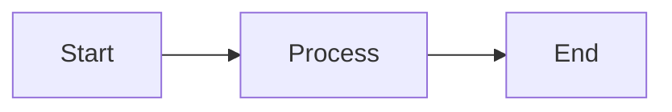
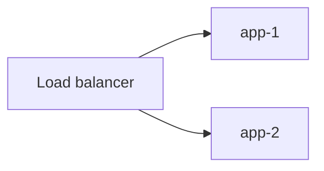
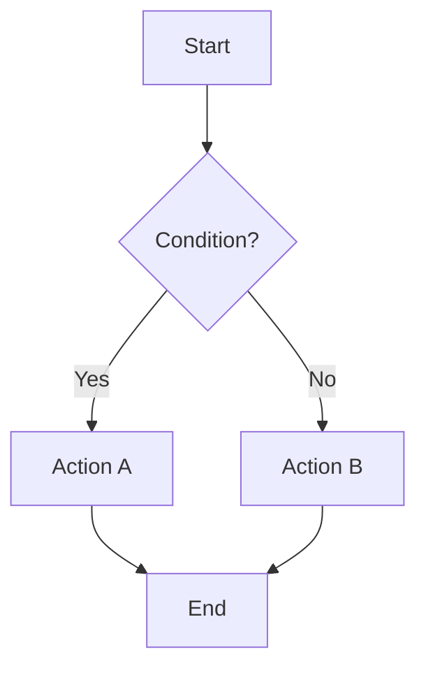
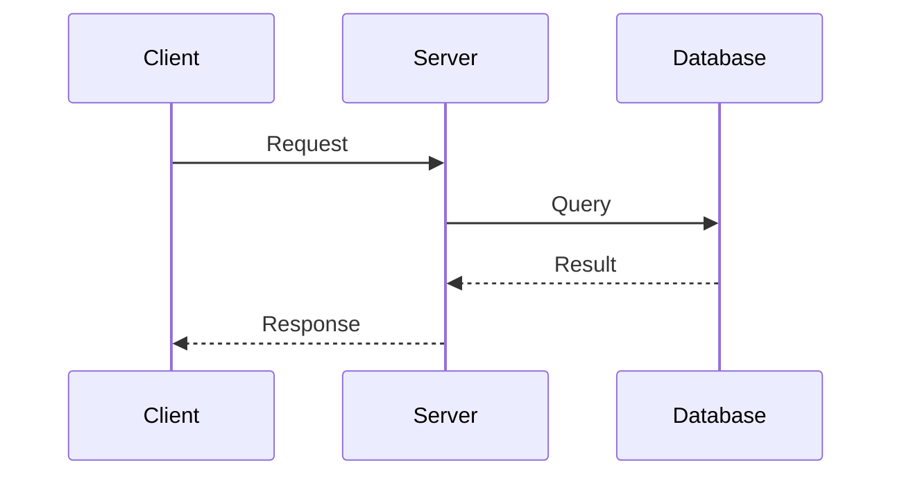
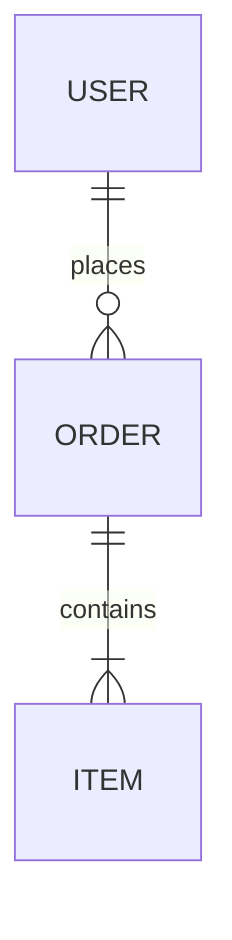
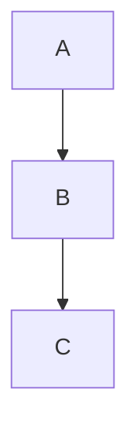
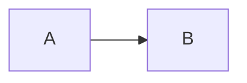

# Mermaid Diagrams

Tap renders Mermaid diagrams automatically from fenced code blocks.

## Syntax

Use a `mermaid` code block:

````markdown

```mermaid
flowchart LR
    A[Start] --> B[Process] --> C[End]
```
````

## Supported Diagram Types

- `flowchart` - Process flows, decision trees (use `LR`, `TD`, `TB`, `RL`, `BT` for direction)
- `sequenceDiagram` - API calls, system interactions
- `classDiagram` - Object-oriented designs
- `stateDiagram-v2` - State machines
- `erDiagram` - Database entity relationships
- `gantt` - Project timelines
- `pie` - Data distribution
- `gitGraph` - Branch visualization
- `mindmap` - Concept mapping

## Theme Integration

Each of the 21 themes defines its own Mermaid colors (node fill, stroke,
and text) and curve style in its `theme.json`, so a diagram always sits in
the deck's palette. A flowchart in `terminal` reads terminal-green; the
same diagram in `blueprint` reads as white line work on drafting blue.

Diagrams render after the theme's fonts are ready and re-render when the
theme changes, including the `t` key and `?theme=`.

A diagram can mark its app-server style nodes with the `quiet` class to
pick up each theme's own quiet styling:

````markdown

```mermaid
flowchart LR
    A[Load balancer] --> B[app-1]
    A --> C[app-2]
    class B,C quiet
```
````

Tap appends the theme's `classDef quiet` for you, unless the diagram
defines its own `quiet` class.

## Common Patterns

### Flowchart with Decision

````markdown

```mermaid
flowchart TD
    A[Start] --> B{Condition?}
    B -->|Yes| C[Action A]
    B -->|No| D[Action B]
    C --> E[End]
    D --> E
```
````

### Sequence Diagram

````markdown

```mermaid
sequenceDiagram
    Client->>Server: Request
    Server->>Database: Query
    Database-->>Server: Result
    Server-->>Client: Response
```
````

### Entity Relationship

````markdown

```mermaid
erDiagram
    USER ||--o{ ORDER : places
    ORDER ||--|{ ITEM : contains
```
````

## With Layouts

Combine with two-column layout:

```markdown
<!--
layout: two-column
-->

# System Flow

Description of the process.

::right


```mermaid
flowchart TD
    A --> B --> C
```
```

## With Fragments

Reveal diagrams with animation:

````markdown
<!-- fragment -->

```mermaid
flowchart LR
    A --> B
```
````

## Best Practices

- Keep diagrams simple (5-10 nodes max) for readability at presentation scale
- Use short labels
- Match diagram complexity to slide content
- Test diagrams render correctly before presenting

## Error Handling

Syntax errors display:
- Error message
- Original code for debugging

Fix the markdown and save to re-render.
