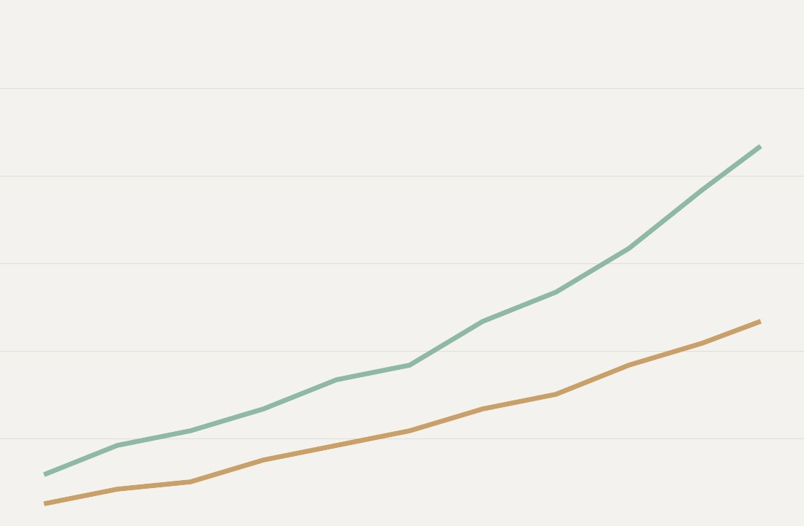
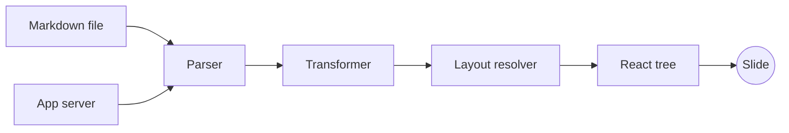

<!-- layout: title -->

# Scaling a Markdown Renderer

Notes from a slide deck that started as a weekend project

---

<!--
layout: title
tag: "01 · Kickoff"
-->

# A Very Long Title That Should Wrap Gracefully Across Multiple Lines Without Overflowing The Slide

## A short subtitle

---

<!--
layout: section
tag: "02 · Foundations"
-->

## Foundations

---

<!-- layout: default -->

# Every system has a bottleneck.

---

<!--
layout: default
badge: "v2.0"
-->

## What broke first

- Parsing was fast, but nested lists blew up the allocation count
  - Deeply nested bullets are common in real talks
  - Each level added another slot lookup
- Live [driver connections](https://example.com/drivers) leaked file descriptors

---

<!--
layout: two-column
notes: Left column stays static, right column reveals with a fragment.
-->

## Two ways to scale

::left

### Vertically

- Bigger machines
- Simpler operational model
- A ceiling you eventually hit

::right

### Horizontally

<!-- pause -->

- More machines
- Harder coordination
- No practical ceiling

---

<!--
layout: three-column
notes: Compares three deployment tiers.
-->

## Deployment tiers

::left

### Solo

- One process
- One region
- Good enough for a talk

::center

### Team

- A handful of processes
- Two regions
- Good enough for a product

::right

### Platform

- Hundreds of processes
- Every region
- Good enough for a company

---

<!--
layout: code-focus
notes: The highlighted line is the actual fix.
-->

## The fix, in one line

```go {3}
func render(slides []Slide) string {
    var buf strings.Builder
    buf.Grow(estimateSize(slides))
    for _, slide := range slides {
        buf.WriteString(slide.HTML())
    }
    return buf.String()
}
```

---

<!-- layout: default -->

## Code without highlights

Sometimes the whole block matters, not just one line.

```python
def estimate_size(slides):
    total = 0
    for slide in slides:
        total += len(slide.html)
    return total
```

---

<!--
layout: big-stat
-->

# 40x

::caption

Faster cold start after the rewrite, measured across a thousand runs

---

<!--
layout: quote
notes: A quote slide with an attribution slot.
-->

> Premature optimization is the root of all evil, and so is shipping unmeasured.

::attribution

Someone who learned this the hard way

---

<!--
layout: default
-->

## A photo, unstyled

Every theme needs to give a plain image on a plain slide some kind of treatment.



---

<!--
layout: split-media
notes: Image and text side by side.
-->

## Split media

### The chart everyone asks for

Traffic doubled every quarter, then flattened once caching landed.

::media


---

<!--
layout: cover
background: "#1a1a2e"
-->

# One idea per slide

The cover layout exists for the moment that needs the whole frame

---

<!--
layout: sidebar
-->

## Sidebar layout

The main column carries the argument. The sidebar carries the receipts.

- Point one, argued in full sentences
- Point two, with a `code` reference
- Point three, the one people remember

::sidebar

### Sources

- Internal postmortem, Q2
- Load test logs
- The pager, at 3am

---

<!-- layout: blank -->

<div style="position: absolute; inset: 0; display: flex; align-items: center; justify-content: center;">
  <h1>A blank canvas slide</h1>
</div>

---

<!-- layout: default -->

## Every inline element at once

Visit the [project repository](https://example.com/repo) for the source. **Bold claims** need `inline code` to back them up, and *italic asides* soften the blow. Headings below range from `h3` to `h6`.

### An h3 heading

#### An h4 heading

##### An h5 heading

###### An h6 heading

---

<!-- layout: default -->

## Numbers behind the rewrite

| Metric | Before | After |
|---|---|---|
| Cold start | 1400ms | 35ms |
| Peak memory | 2.1GB | 340MB |
| Slides per second | 12 | 480 |
| On-call pages | 9/month | 0/month |

---

<!--
layout: default
notes: Reveals one bullet at a time.
-->

## Fragments

<!-- pause -->

The first thing we tried didn't work.

<!-- pause -->

The second thing worked, but only on Tuesdays.

<!-- pause -->

The third thing is what shipped.

---

<!--
scroll: true
scroll-speed: 500
-->

## A slide that scrolls

```typescript
// Long enough to require a scroll reveal on any theme's minimum sizes
interface RenderPass {
  id: number;
  slideCount: number;
  durationMs: number;
}

class RenderPipeline {
  private passes: RenderPass[] = [];

  record(pass: RenderPass): void {
    this.passes.push(pass);
  }

  slowest(): RenderPass | undefined {
    return this.passes.reduce<RenderPass | undefined>((slowest, pass) => {
      if (!slowest || pass.durationMs > slowest.durationMs) {
        return pass;
      }
      return slowest;
    }, undefined);
  }

  average(): number {
    if (this.passes.length === 0) return 0;
    const total = this.passes.reduce((sum, pass) => sum + pass.durationMs, 0);
    return total / this.passes.length;
  }
}

const pipeline = new RenderPipeline();
pipeline.record({ id: 1, slideCount: 40, durationMs: 12 });
pipeline.record({ id: 2, slideCount: 220, durationMs: 61 });
pipeline.record({ id: 3, slideCount: 9000, durationMs: 340 });

export { RenderPipeline };
```

This line sits below the fold and should only appear once the slide has scrolled.

---

<!-- layout: default -->

## How the renderer talks to itself



Background app-server nodes carry the theme's quiet styling.

---

<!--
layout: default
notes: Live shell execution.
-->

## Live code execution

```bash {driver: shell}
echo "Building the deck..."
echo "Done."
```

---

<!-- layout: default -->

## A recorded terminal session

```asciinema {src: "./themes-demo.cast"}
```

---

<!-- layout: blank -->

```map
start: 40.7128, -74.0060
end: 51.5074, -0.1278
zoom: 4
duration: 2000
markers: true
```

---

<!-- layout: title -->

# Thank You

Questions, complaints, and pull requests welcome

---

<!--
layout: quote
notes: A long quote (over 180 runes), for data-length="long" coverage on the quote layout.
-->

> The rewrite did not fix scaling by being clever. It fixed it by being boring: cache the output, measure the real bottleneck before touching a line of code, and ship the smallest change that moves the number you are actually watching.

::attribution

Someone who learned this the hard way, twice
